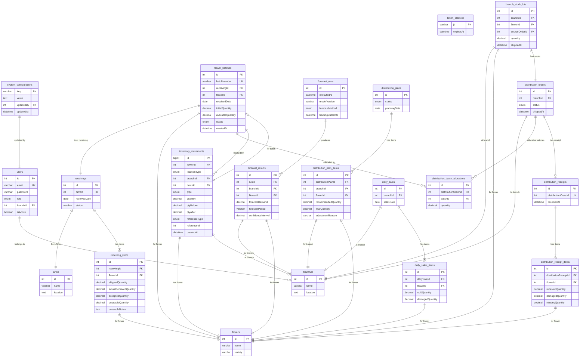

# BloomFlow Entity Relationship Diagram

Based on RFC-009 (PostgreSQL Data Model) and the Prisma schema.

## ERD



## Tables

| Table | Description |
|-------|-------------|
| `users` | System users with roles (SUPERADMIN, STAFF_HEAD_OFFICE, STAFF_BRANCH) |
| `farms` | Flower supplier farms |
| `branches` | Distribution branches |
| `flowers` | Flower catalog (name + variety) |
| `system_configurations` | Key-value system settings |
| `token_blacklist` | JWT blacklist for logout |
| `receivings` | Head Office receiving records from farms |
| `receiving_items` | Line items per receiving (per flower) |
| `flower_batches` | HO inventory batches created from accepted receiving quantities |
| `forecast_runs` | ML/baseline forecast execution metadata |
| `forecast_results` | Per branch+flower demand forecasts |
| `distribution_plans` | Distribution planning sessions |
| `distribution_plan_items` | Recommended/final quantities per branch+flower |
| `distribution_orders` | Shipment orders to branches |
| `distribution_batch_allocations` | FIFO batch allocation per order |
| `distribution_receipts` | Branch-side receiving confirmation |
| `distribution_receipt_items` | Received/damaged/missing quantities per flower |
| `branch_stock_lots` | Branch inventory lots (age tracked from shippedAt) |
| `daily_sales` | Daily sales report per branch |
| `daily_sales_items` | Sold/damaged quantities per flower |
| `inventory_movements` | Immutable audit trail for all stock changes |

## Key Constraints

```sql
-- Receiving validation
CHECK (accepted_quantity + unusable_quantity = actual_received_quantity)
CHECK (actual_received_quantity <= shipped_quantity)

-- Distribution receiving validation
CHECK (received_quantity + damaged_quantity + missing_quantity = shipped_quantity)

-- General
CHECK (quantity >= 0)
CHECK (available_quantity >= 0)

-- Uniqueness
UNIQUE (branch_id, sales_date)
UNIQUE (distribution_order_id, batch_id)
```

## Movement Types

| Type | Description |
|------|-------------|
| `RECEIVING_IN` | Stock enters HO from farm receiving |
| `DISTRIBUTION_OUT` | Stock leaves HO during shipment |
| `DISTRIBUTION_IN` | Stock arrives at branch |
| `SALE_OUT` | Stock sold to customer |
| `DAMAGED_OUT` | Stock marked as damaged |

## Status Enums

| Enum | Values |
|------|--------|
| `BatchStatus` | AVAILABLE, DEPLETED |
| `DistributionPlanStatus` | DRAFT, FINALIZED, ORDER_CREATED |
| `DistributionOrderStatus` | DRAFT, IN_TRANSIT, RECEIVED, CANCELLED |
| `ForecastMethod` | ML, BASELINE |
| `InventoryMovementType` | RECEIVING_IN, DISTRIBUTION_OUT, DISTRIBUTION_IN, SALE_OUT, DAMAGED_OUT |
| `UserRole` | SUPERADMIN, STAFF_HEAD_OFFICE, STAFF_BRANCH |

## Recommended Indexes

```sql
-- FIFO batch allocation
CREATE INDEX idx_flower_batches_fifo ON flower_batches(flower_id, status, received_date, created_at);
CREATE INDEX idx_branch_stock_lots_fifo ON branch_stock_lots(branch_id, flower_id, status, shipped_at);

-- Dashboard queries
CREATE INDEX idx_daily_sales_dashboard ON daily_sales(branch_id, sales_date);
CREATE INDEX idx_forecast_results_lookup ON forecast_results(branch_id, flower_id, forecast_period);
CREATE INDEX idx_distribution_orders_status ON distribution_orders(branch_id, status);
CREATE INDEX idx_inventory_movements_audit ON inventory_movements(reference_type, reference_id);
```
